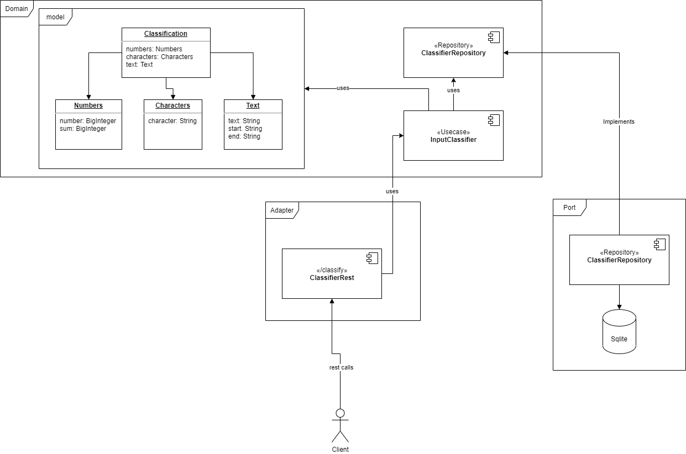
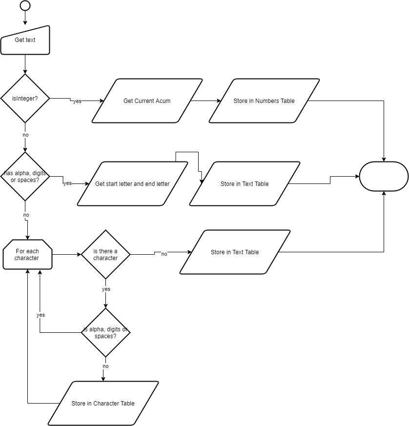

# Apalabrados



## Flow Diagram

### Use case: Input Classifier

> Get a text an classify it into three categories: numbers (integers only), text (alpha and digits only) or character (not alpha and neither digits)



## Endpoints

1. **/docs** show documentation of the service
2. **/classify?text=value** execute the logic to classify an input

## Building

```bash
docker-compose build
```

## Running

```bash
docker-compose up
```
The application expose a port **8080**


## Public URL

### Backend

1. https://ff-apalabrados.herokuapp.com/classify?text=1000
2. https://ff-apalabrados.herokuapp.com/docs

### Frontend

1. https://ff-apalabrados.netlify.app/
